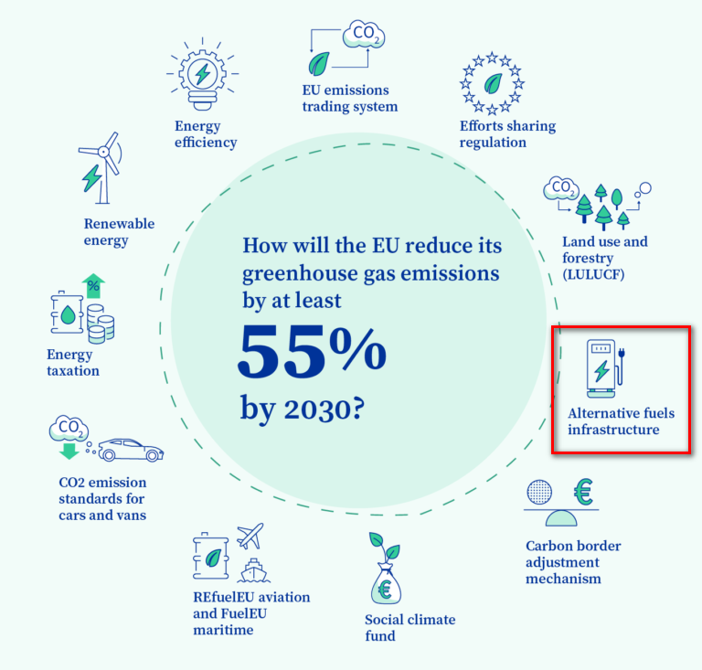

# eMobility @ Europe

A repository containing a wide range of information related with electric mobility in Europe, with a focus on Portugal.

Here you can find references to legal frameworks, existing APIs, documentation and data.

The goal is to track the evolution of sustainable mobility milestones on each European country and also find inconsistencies and blockers.

**Structure**

- ./data  - contains data sources and analysis outputs
- ./docs  - contains technical documents (mainly in PDF)
- ./legal - contains legal documents (mainly in PDF)
- ./src   - contains source code

> NOTE: Work in Progress. Join the cause!

## The European Green Deal

The European Green Deal is a set of policy initiatives launched by the European Union (EU) aimed at making Europe the first climate-neutral continent by 2050. This means reducing greenhouse gas emissions to a level where they are balanced by removal or offsetting, effectively eliminating the net contribution to global warming.

**Key Goals**:
1. **Climate Neutrality by 2050**: The primary goal is to reduce EU's greenhouse gas emissions by at least 55% by 2030 (from 1990 levels) and to achieve full climate neutrality by 2050.

2. **Economic Growth Decoupled from Resource Use**: The deal promotes economic growth that doesn't rely on the unsustainable consumption of natural resources, transitioning towards a circular economy where waste is minimized and resources are reused.

3. **No Person and No Place Left Behind**: The Green Deal includes a "Just Transition Mechanism" to support regions and workers who might be adversely affected by the transition to a green economy, ensuring fairness and equity in the shift towards sustainability.

**Priorities**:
1. Clean Energy
    - Supplying clean, affordable and secure energy
2. Circular Economy
    - Mobilising industry for a clean and circular economy
3. Efficient Renovations
    - Building and renovating in an energy andd resource efficient way
4. Sustainable Mobility
    - Accelerating the shift to sustainable and smart mobility
5. Sustainable Food
    - From 'Farm to Fork': designing a fair, healthy and environmentally-friendly food system
6. Preserving Biodiversity
    - Preserving and restoring ecosystems and biodiversity
7. Climate Action
    - Increasing the EU's climate ambition for 2030 and 2050
8. Zero Pollution
    - A zero pollution ambition for a toxic-free environment

More info: 
- https://commission.europa.eu/strategy-and-policy/priorities-2019-2024/european-green-deal_en
- https://sharedgreendeal.eu/

## The Fit for 55 package

The **Fit for 55 package** is a central part of the **European Green Deal**. It consists of a set of legislative proposals designed to ensure that the European Union (EU) meets its target of reducing greenhouse gas emissions by 55% by 2030 (compared to 1990 levels), which is a crucial milestone towards achieving the broader goal of climate neutrality by 2050 as outlined in the European Green Deal.

 

More info: https://www.consilium.europa.eu/en/policies/green-deal/fit-for-55/

## AFIR - Alternative Fuels Infrastructure Regulation

The **Alternative Fuels Infrastructure Regulation (AFIR)** is a key legislative proposal within the **Fit for 55 package**, which itself is part of the broader **European Green Deal**. AFIR aims to establish a comprehensive and cohesive infrastructure across the European Union for alternative fuels, such as electricity, hydrogen, and biofuels, to support the decarbonization of the transport sector.

- [Summary Info EN](https://eur-lex.europa.eu/EN/legal-content/summary/deployment-of-alternative-fuels-infrastructure.html)
- [Summary Info PT](https://eur-lex.europa.eu/PT/legal-content/summary/deployment-of-alternative-fuels-infrastructure.html)
- [Proposal](https://eur-lex.europa.eu/legal-content/EN/TXT/?uri=CELEX:52021PC0559)
- [Regulation](http://data.europa.eu/eli/reg/2023/1804/oj)
- [Q&A](https://transport.ec.europa.eu/transport-themes/clean-transport/alternative-fuels-sustainable-mobility-europe/alternative-fuels-infrastructure/questions-and-answers-regulation-deployment-alternative-fuels-infrastructure-eu-20231804_en)

## Portuguese Law

- [DL 39/2010 @ Journal of the Republic](https://diariodarepublica.pt/dr/legislacao-consolidada/decreto-lei/2010-171436738)
- [DL 39/2010 as PDF](legal/DL_39_2010.pdf)
- Regulation (Portuguese Only): [RME](legal/RME%20Consolidado.pdf)
- RME Changes between 2021 and 2023: [RME Diff](legal/RME_Diff_2021_2023.pdf)

## National Access Points (NAP)

### Norway - Nobil

- Info: https://info.nobil.no/api
- Doc: https://info.nobil.no/images/API-dokumentasjon/API_NOBIL_Documentation_v3_20240603.pdf

### Portugal -Mobi.e

NOTE: Mobi.e's reach and responsabilities extend beyond a NAP

- Info: https://mobie.pt/en/mobienetwork/finding-charging-points
- Docs: https://www.mobie.pt/en/mobility/technical-rules-procedures

## Possible barriers for eMobility in Portugal

### Autoridade da Concorrência (AdC)

The Portuguese Competition Authority – Autoridade da Concorrência (AdC) carried out an analysis of the competition conditions in the electric vehicle recharging sector, which resulted in the identification of barriers that could jeopardise the development and expansion of an electric vehicle recharging network with adequate, efficient, and competitive coverage.

 

**Sources**:
- [Main Page EN](https://www.concorrencia.pt/en/articles/adc-detects-barriers-expansion-electric-vehicle-recharging-network-and-issues)
- [Main Page PT](https://www.concorrencia.pt/pt/artigos/adc-deteta-barreiras-expansao-da-rede-de-mobilidade-eletrica-e-emite-recomendacoes-ao)
- Complete report on study (Portuguese Only): [AdC Report](legal/Adc_Report.pdf)
- One Pager PT: [AdC One Pager PT](legal/AdC_One_Pager_PT.pdf)
- One Pager EN: [AdC One Pager EN](legal/AdC_One_Pager_EN.pdf)

### AVERE

AVERE has taken note of the preliminary report of the Estudo concorrência e mobilidade elétrica em Portugal and wish to express our agreement with the intention of the recommendations made to the Portuguese government to make fundamental changes to the Portuguese recharging network, to improve the current system in benefit of BEV users.

- [Blog Page](https://www.avere.org/blogpages/policy-details/2024/03/05/AVEREs-Reaction-Letter-to-the-Report-on-Recharging-Network-Published-by-the-Portuguese-Competition-Authority)
- Reaction Letter: [AVERE's Reaction Letter](legal/AVERE_Reaction_Letter_AdC.pdf)
